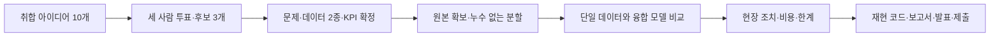

# Q.AI 제조데이터 경진대회 청사진

작성: 2026-09-26 · 팀 실행계획 초안. 문제·데이터·KPI 확정은 세 사람이 결정 기록에 남긴다.

## 목표와 현재 위치

현장의 손실 한 가지를 정의하고, KAMP 데이터 2종 이상의 결합이 그 문제 해결에 어떤 도움을 주는지 재현 가능한 비교로 증명한다. 최종 결과는 예측값뿐 아니라 작업자가 취할 조치와 비용·KPI로 설명한다.

현재 준비된 것은 가이드북 텍스트 50종, 비교표, 공통 스킬 5개, JARI 회의 보드와 개인 에이전트 설치다. 아이디어 취합본, 최종 문제·2종·KPI, 분석 원본 데이터, 학습 결과는 아직 확정되지 않았다. 가이드북은 분석 원본이 아니다.

## 1. 회의에서 한 가지 문제를 정한다

1. 사용자가 취합한 10개를 제공하면 원문 근거만 보드에 반영한다.
2. 각자 최대 3표를 주고 후보 3개를 사람이 선정한다. 표 수는 결정을 돕는 자료다.
3. 후보마다 현장 손실, 예측 시점, 가능한 조치, 주·보조 데이터 ID, 목표변수, 연결 근거, KPI를 비교한다.
4. 결합 근거가 없거나 결과를 보고서로 설명할 수 없는 후보는 보류한다. 같은 업종이라는 이유만으로 서로 다른 공장의 행을 조인하지 않는다.
5. 최종 문제 1문장, 데이터 ID 2종, KPI 산식, 담당자와 차선 후보를 `decision-log.md`에 사람이 기록한다.

회의 종료 문장: “누가 / 언제 / 어떤 신호로 / 어떤 손실을 예측하고 / 무엇을 조치하며 / 어떤 KPI로 판단한다.” 빈칸이 있으면 확정으로 표시하지 않는다.

## 2. 실행 일정 제안

아래 작업일은 팀 제안이다. 공식 제출기한은 로컬 과제 기록 기준 10월 8일 23:59이며, 제출 전에 공식 포털에서 재확인한다. 9월 27일은 일요일이다.

| 기간 | 할 일 | 완료 근거 |
| --- | --- | --- |
| 9/26 | 10개 취합·후보 3개 비교 | 원문과 연결된 아이디어·근거 |
| 9/27 | 문제·2종·KPI 확정, 이후 원본 확보 | 결정 기록·출처·해시·데이터 카드 |
| 9/28–29 | 데이터 구조·시간·라벨 확인, 분할 고정, 최소 모델 | 분할 기준·GBDT 기준 성능·실행 명령 |
| 9/30–10/2 | 융합 효과와 실패 조건 비교 | 같은 평가셋의 단일/융합 비교·누수 점검 |
| 10/3–4 | 현장 조치·임계값·KPI와 시연 연결 | 조치 화면·비용 가정·오탐/미탐 사례 |
| 10/5–6 | 결과 수치 잠금·공식 양식 보고서·재실행 | 코드 결과와 모든 표의 수치 일치 |
| 10/7 | 다른 노트북에서 재현·블라인드·파일 점검 | 제출 후보 묶음·남은 오류 목록 |
| 10/8 | 여유를 두고 최종 제출 | 사용자가 제출하고 접수 결과 확인 |

9/27 이전에는 원본 다운로드·학습을 시작하지 않는다. 확정이 늦어지면 모델 종류 확대와 UI 추가를 줄이고, 재현성과 융합 비교를 우선한다.

## 3. 역할과 하루 운영

| 담당 | 주 책임 | 공유 결과 |
| --- | --- | --- |
| 정진우 | 아이디어 취합, JARI·설치, 추론 인터페이스, 제출 통합 | 동작 경로·README·시연 |
| 엄예지 | 현장 문제, 손실·KPI·비용 근거, 보고서·발표 | 배경 근거·KPI 산식·보고서 |
| 최연식 | 데이터 연결·품질·분할, 기준 모델·융합 비교 | 데이터 카드·실험 결과·한계 |
| 전원 | 최종 선정·잠금, 다른 사람 산출물 검토 | 결정 기록·재현 확인 |

매일 짧게 “완료한 것 / 막힌 것 / 다음 한 가지”를 공유한다. JARI는 회의·최근 보고, Git은 코드·문서 이력, 각 노트북 에이전트는 개인 작업을 담당한다. 에이전트가 사람 대신 투표하거나 결정하지 않는다.

## 4. 모델과 근거의 최소 구성

- 데이터: 단위·시간·설비·LOT·라벨 생성 시점·결측·중복·출처·해시를 기록한다.
- 연결: 실제 공통 키 또는 정당화된 결합 방법과 계보를 설명한다. 불가능하면 후보를 다시 고른다.
- 비교: 단순 기준 → 주 데이터만 → 보조 데이터만(가능할 때) → 융합. 동일 분할·평가 기준을 사용한다.
- 검증: 시간 또는 설비/LOT 그룹 분할, 전처리의 학습 범위, 사후 변수와 중복 윈도우를 확인한다.
- 평가: 문제에 맞는 성능 지표와 오탐·미탐 비용을 함께 기록한다. 개선이 없으면 그대로 보고한다.
- 현장: 예측 시점 → 경보 → 점검/조건 조정/격리 → 사람 확인의 흐름을 시연한다.
- 효과: 실제 관측 결과, 가정에 의한 비용 시뮬레이션, 향후 기대효과를 구분한다. 수상·현장 개선을 보장하지 않는다.

## 5. 배경자료를 쓰는 방법

KAMP 50종은 문제·데이터 후보 탐색에 사용하고, 확정 후에는 해당 2종을 집중 검토한다. 뿌리산업 자료는 업종·공정·도입 배경을 설명하는 근거로 사용한다. 산업 통계를 모델 입력이나 우리 현장의 실측 효과로 바꾸지 않는다. 통계는 연도·대상·단위·원문 페이지를 함께 적는다.

## 6. 제출 완료 기준

- 코드·환경·데이터 확보 방법·추론 입출력이 문서화되고 다른 노트북에서 재현된다.
- 단일 데이터 대비 융합의 효과와 한계를 같은 조건에서 설명한다.
- 보고서·발표의 수치가 실험 결과와 일치한다.
- 공식 양식, 블라인드, 제출 파일 구성, 설문 등은 제출 직전 다시 대조한다.
- Git에서 원본을 제외하는 것과 공식 제출물에 필요한 데이터를 포함하는 것은 별도다. 제출 구성은 공식 계약을 따른다.

근거: [실행 계약](../AGENT.MD), [과제 기록](task-lock-2026-09-21.md), [팀 현황](agent-team-status.md), [선택표](../reports/dataset-selection-matrix.csv), [공식 공지 로컬 사본](../knowledge/kamp-public-2026-09-21/noticeDetail-NOTICE_SEQ-87.md).
